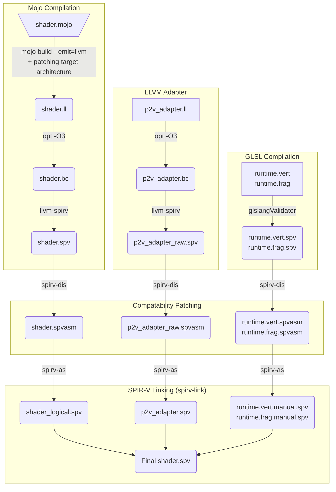
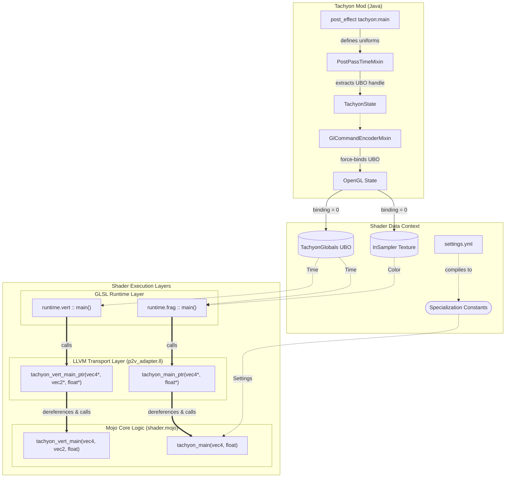

## Compilation Pipeline

## Layers
Layers will merge in the build process. This diagram shows the complete control flow (nested function calls) and data flow (how Java provides data to the shader).

