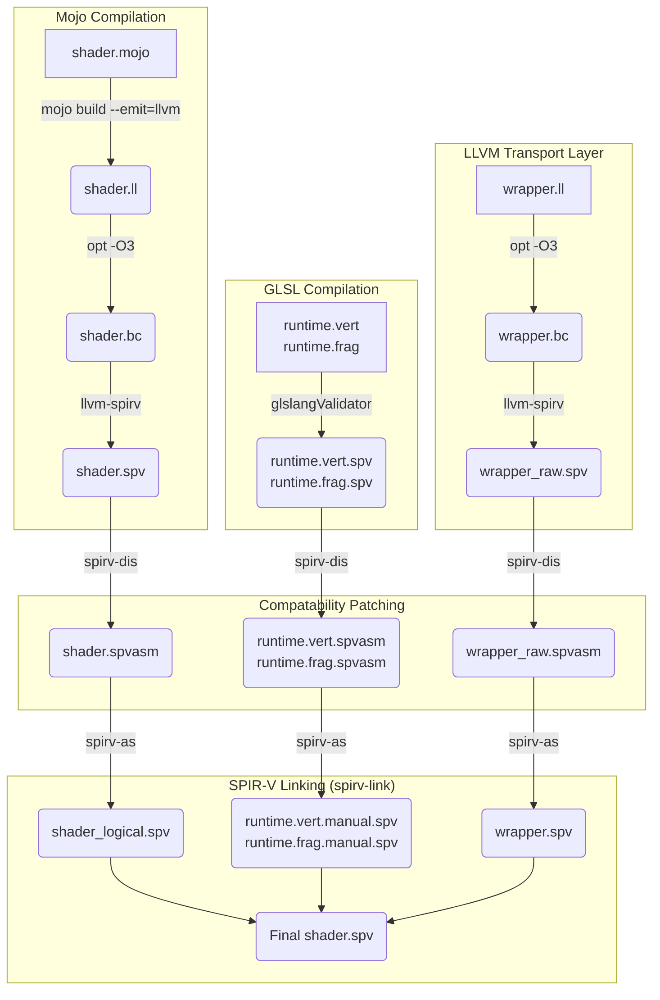

## Compilation Pipeline

<!-- ### The LLVM Transport Layer (`wrapper.ll`)
Mojo (via LLVM-SPIRV) expects function arguments to be passed by **value** (e.g., `<4 x float>`), while OpenGL/GLSL passes variables between shader stages by **pointer**. 
To resolve this ABI mismatch without manually writing SPIR-V assembly, we use `wrapper.ll`. This small LLVM IR file acts as a transport layer: it takes the pointer arguments provided by GLSL, loads their values, and passes them to the pure Mojo function. It is compiled and linked directly into the final SPIR-V binary. -->

## Layers
