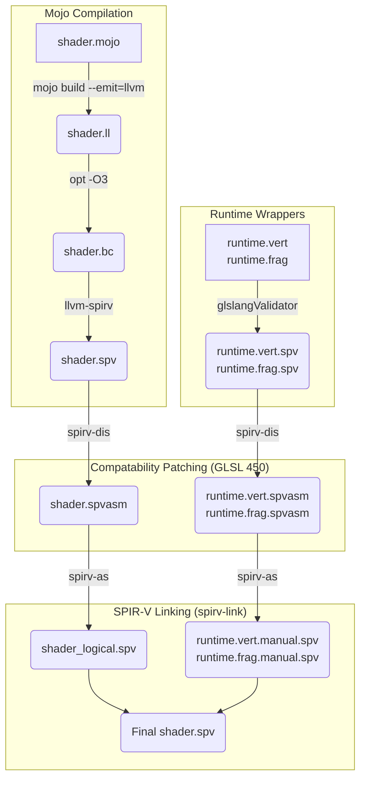

## How it works

```mermaid
flowchart TD
    subgraph Mojo Pipeline ["Mojo Compilation"]
        M1[shader.mojo] -->|mojo build --emit=llvm| M2(shader.ll)
        M2 -->|opt -O3| M3(shader.bc)
        M3 -->|llvm-spirv| M4(shader.spv)
    end

    subgraph Runtime ["Runtime Wrappers"]
        R1[runtime.vert<br>runtime.frag] -->|glslangValidator| R2(runtime.vert.spv<br>runtime.frag.spv)
    end

    subgraph Patching ["Compatability Patching (GLSL 450)"]
        M4 -->|spirv-dis| P1(shader.spvasm)
        R2 -->|spirv-dis| R3(runtime.vert.spvasm<br>runtime.frag.spvasm)
    end
    
    subgraph Linker ["SPIR-V Linking (spirv-link)"]
        P1 -->|spirv-as| L1(shader_logical.spv)
        R3 -->|spirv-as| L2(runtime.vert.manual.spv<br>runtime.frag.manual.spv)
        L1 --> LF(Final shader.spv)
        L2 --> LF
    end
```