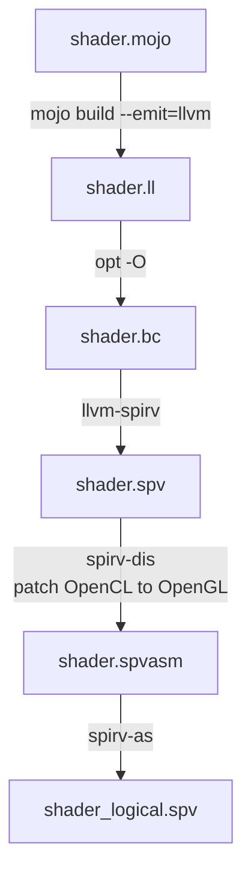

## How it works

```mermaid
flowchart TD
    shader.mojo -->|mojo build --emit=llvm| shader.ll
    shader.ll -->|opt -O| shader.bc
    shader.bc -->|llvm-spirv| shader.spv
    shader.spv -->|spirv-dis<br>patch OpenCL to OpenGL| shader.spvasm
    shader.spvasm -->|spirv-as| shader_logical.spv
```